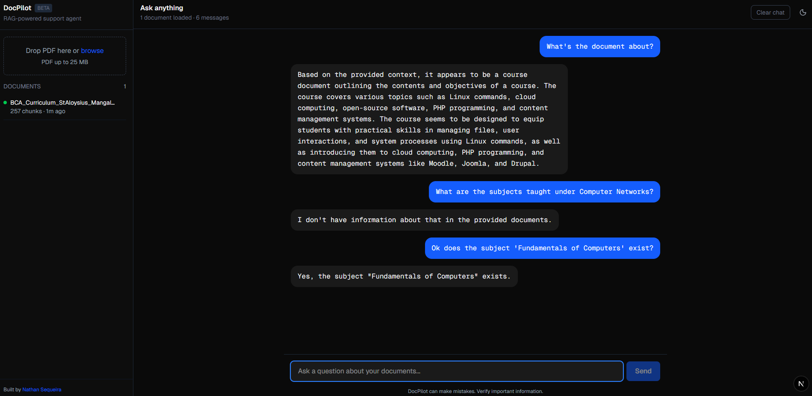
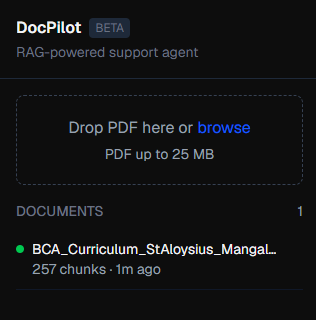

# docpilot-rag-groq-qdrant

> A customer support chatbot that actually knows your business — because you train it on your own documents.

A working RAG (Retrieval-Augmented Generation) application: upload a PDF, ask questions about it, get streamed answers grounded entirely in that document — running on a 100% free, self-hostable stack.

---

## What It Does

Upload any PDF. The system splits it into chunks, converts each chunk into a vector embedding (locally — no API key needed for this part), and stores it in Qdrant. Ask a question in the chat, and the system finds the most relevant chunks, sends them to an LLM along with your question, and streams back an answer token by token. If the answer isn't in your document, it says so — it doesn't make things up.

<br>
*Real conversation, grounded in an uploaded PDF — including a follow-up question and a language switch mid-conversation.*

---

## Tech Stack

| Layer | Tool | Why |
|---|---|---|
| **Frontend** | Next.js 15 + TypeScript | Modern React framework, strong hiring signal for EU/AI-adjacent startups |
| **Backend** | FastAPI (Python) | Async-native, built for streaming AI responses |
| **Vector Database** | Qdrant | Open-source, self-hostable, no paid tier required |
| **LLM** | Groq (Llama 3.1 8B) | Free tier, extremely fast inference |
| **Embeddings** | sentence-transformers (local) | Runs on your own machine — no embedding API exists on Groq, so this was a deliberate pivot mid-build |
| **Containerization** | Docker + docker-compose | One-command local setup |

---

## Features

- ✅ Drag-and-drop PDF upload with live chunk-count feedback
- ✅ Semantic search across uploaded documents — finds relevant content by meaning, not keywords
- ✅ Streaming chat responses (token-by-token, not a long wait then a wall of text)
- ✅ Answers strictly grounded in your documents — explicit "I don't know" when the answer isn't there
- ✅ Document management — remove a document and its data is fully deleted from the vector store
- ✅ Sidebar synced with real Qdrant state on every page load — no stale data across refreshes
- ✅ Rate limiting (10 req/min per IP) to stay within free-tier API limits
- ✅ Full Docker setup — entire stack runs with a single `docker compose up`
- ✅ Basic test suite — unit tests for all core endpoints, with a real bug caught and fixed during testing
- ✅ Light/dark theme, defaults to your OS preference

<br>
*Document tracking sidebar — upload status, chunk counts, and one-click removal.*

---

## Try It Yourself

No paid hosting, no live demo link — instead, a complete local setup guide that gets you running in under 10 minutes:

👉 **[SETUP.md](SETUP.md)** — clone, install, run locally

Want to see how this would be deployed to production (Railway/Render)? That's documented too, even without a permanently-running free instance:

👉 **[DEPLOYMENT.md](DEPLOYMENT.md)** — full deployment walkthrough

---

## Architecture

```
User Browser
     │
     ▼
Next.js 15 (TypeScript)              ← port 3000
  Two-panel UI: document sidebar + streaming chat
     │
     │  HTTP (JSON / FormData / SSE)
     ▼
FastAPI (Python)                     ← port 8000
  POST   /ingest         — chunk + embed + store in Qdrant
  GET    /ingest         — list documents synced from Qdrant
  DELETE /ingest/{file}  — remove a document's chunks
  POST   /chat           — retrieve + Groq Llama 3 → stream tokens
  GET    /health         — service health check
     │
     ├── Qdrant (Docker)             ← vector store
     └── Groq API                    ← LLM (chat only — no embeddings exist on Groq)
```

---

## What's Not Included (Yet)

Being upfront about scope:

- **No source citations** — the system doesn't yet show *which* chunk/page an answer came from. This is a planned **v1.1 feature**, intentionally scoped out of the initial build to ship a clean MVP on schedule.
- **No authentication** — anyone with access to a running instance can upload/delete documents
- **No multi-user support** — one shared knowledge base, not per-user isolation

---

## Documentation

This project has a full day-by-day engineering log — every decision, every bug encountered and fixed, every concept learned, written up as it happened across a 10-day build:

- 📁 [`Documentation/notes/`](Documentation/notes/) — daily engineering notes (Day 1 through Day 10)
- 📁 [`Documentation/Docker_notes/`](Documentation/Docker_notes/) — Docker commands reference and issues log from Day 9
- 📄 [`Documentation/command-reference.md`](Documentation/command-reference.md) — every command used, copy-paste ready
- 📄 [`Documentation/git-learning-log.md`](Documentation/git-learning-log.md) — Git concepts learned during the build
- 📄 [`Documentation/design-reference.md`](Documentation/design-reference.md) — full UI design specification
- 📄 [`Documentation/CREDITS.md`](Documentation/CREDITS.md) — how this project was built, including AI assistance used

---

## License

MIT — see [LICENSE](LICENSE)